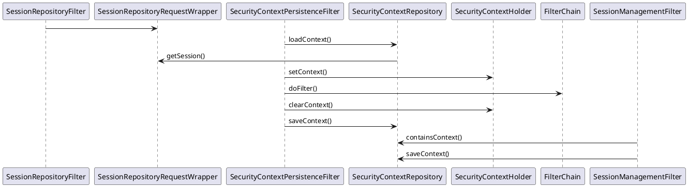

# 3E.Session and Authn

* Supports header-token, cookie-session
* Low security url-string credential ticket
* User manageable session, control login, kick out
* Configurable cookie-name, token-name
* Fine control of concurrent logins, eg., single login for finance only
* Integrated 3rd login, captcha login, credential login
* Admin sudo, super user identity switching
* Session aliases, additional tokens

## 3E.1.Header and Cookie

The token name is set via server.servlet.session.cookie.name by default.
WingsSessionIdResolver supports both header and cookie resolver.
The header and cookie have the same name and both are `session` by default.

Implementation suggestions.

* It is not recommended to use rememberMe, you can set the timeout of session and maxAge of cookie for a longer time
* If there are no special requirements, it is recommended to use the cookie system, because of its ecological maturity

## 3E.2.Customize Cookie

Under the cookie system, the following features can be customized by Filter and Wrapper.

* cookie prefix for multiple apps to share session-cookie under the same domain and path.
* cookie alias to obfuscate the cookie name, affected by prefix
* cookie encoding to control readability and security
  - noop - no encryption, plaintext, e.g. random token, no need to cost CPU
  - b64 - base64, spring's default encryption, only to prevent special chars
  - aes - aes256, primary encryption for non-sensitive data, basic encryption
* customize http-only, secure, domain, path

One thing to note is that

* http-only will make js unreadable, sometimes you need to let it go (watch out for CSRF attacks)
* session settings, should be set in spring-session-79.properties

## 3E.3.Multi-Auth and Login

To seamlessly enhance userPassword login of SpringSecurity, inherit or replace the following classes,

* WingsBindLoginConfigurer : FormLoginConfigurer
* WingsBindAuthenticationToken : UsernamePasswordAuthenticationToken
* WingsBindAuthenticationFilter : UsernamePasswordAuthenticationFilter
* WingsBindAuthenticationProvider : DaoAuthenticationProvider
* WingsUserDetail : UserDetails
* WingsUserDetailService : UserDetailsService

When using, directly replace the formLogin with bindLogin, and when coexisting, the bind must be in front.
Sine Token is an extension to ensure that WingsProvider is processed before DaoAuthenticationProvider.

For example, when implementing SMS authentication or 3rd binding, only WingsUserDetailService needs to be
implemented to handle the authentication type.

* SMS auth, UserDetailsService get the cached and passwordEncoder encrypted SMS
* 3rd binding, recommended justAuth, set loginProcessingUrl to callback address,
  - Authentication.details in the request constructed by AuthnDetailsSource
  - In AuthnProvider first UserDetailsService.load, if NotFound, then try to create users
  - Oauth in particular, , relies heavily on AuthnDetailsSource to get details.

When using WingsBindAuthnProvider instead of the default DaoAuthenticationProvider, there are the following options

* Inherit configure(AuthenticationManagerBuilder) and build it manually via wingsHelper
* Without inheritance, declare the WingsBindAuthnProvider bean and auto-config globally (recommended)
* Without AuthenticationProvider, with WingsUserDetailsService, auto-config using Wings way (default)

If you manually configure userDetailsService and the default configuration, a new provider will be added automatically.
If you do not need to add a provider, you can set wingsBindAuthnProvider(false), different from the Spring default.

## 3E.4.Underlying Principle

With the support of Spring Session, Spring Security can perform the Api pre-auth and token login.

* [PreAuthenticatedProcessingFilter](https://docs.spring.io/spring-security/site/docs/current/reference/html5/#servlet-preauth)
* [UsernamePasswordAuthenticationFilter](https://docs.spring.io/spring-security/site/docs/current/reference/html5/#servlet-preauth)
* SwitchUserFilter - linux su like, global sudo
* RunAsManager - Single method temporary sudo

As a skill enhancement, the following technical points need source code reading or customization.

* SessionRepositoryFilter
* UsernamePasswordAuthenticationFilter
* RememberMeAuthenticationFilter
* SwitchUserFilter
* FilterComparator

The relationship between Session and SecurityContext calls is as follows,

## 3E.5.Related Knowledge

* RequestContextHolder - SecurityContextHolder
* CookieSerializer HttpSessionIdResolver
* SessionEventHttpSessionListenerAdapter - HttpSessionEventPublisher
* rememberMe - SpringSessionRememberMeServices

Wings uses the Hazelcast implementation with its default configuration, the product environment needs to be configured.

If you use `@Enable*HttpSession` to indicate manual configuration, then `spring.session.*` will not be auto configured.
`springSessionRepositoryFilter` will be on top in order to wrap off the original HttpRequest and HttpSession.
